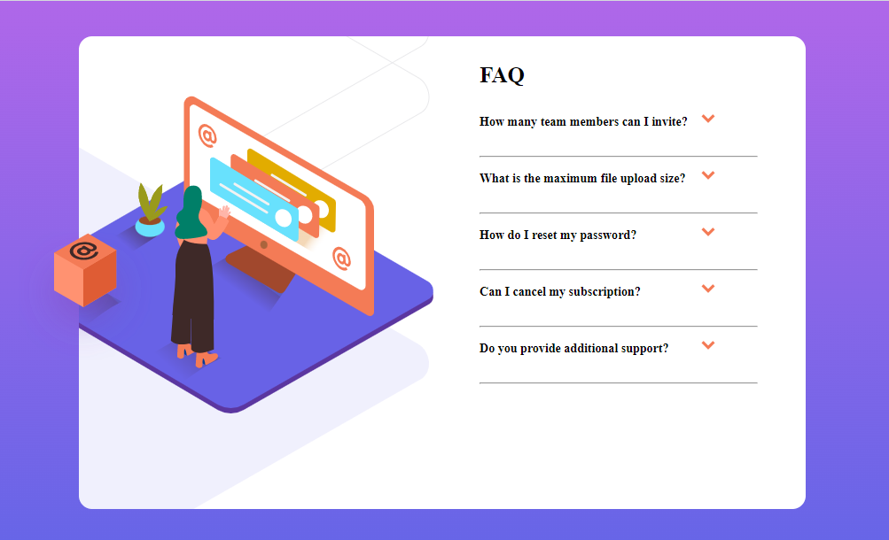

<h1 align="center">FAQ Accordion Card</h1>

  <h3>
    <a href="https://dishantagg24.github.io/faq-accordion-card/" color="white">
      Live
    </a>
     | 
    <a href="https://github.com/dishantagg24/faq-accordion-card">
      Solution
    </a>
    | 
    <a href="https://www.frontendmentor.io/challenges/faq-accordion-card-XlyjD0Oam">
      Challenge
    </a>
  </h3>

## My process

### Built with

- HTML
- CSS
- Javascript
- CSS Custom Properties

## Author

- Website - [Dishant Aggarwal](https://portfolio-site-dishantagg24.vercel.app/)
